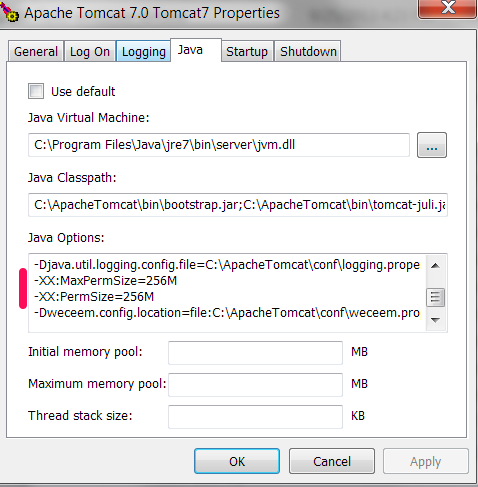

##Procedimiento para hacer un tomcat7 deploy en windows con Rails 4

1. Download JDK7 + tomcat7 + JRuby 1.7.5 + Mariadb5.5(or SQL db) 
  - Bajar el Java Development Kit 7 (o mas reciente), tomcat 7, JRuby 1.7.5 o mas reciente (1.7.10 es el mas reciente) y Mariadb 5.5
2. Set `JRUBY_OPTS --2.0` in Environmental Variables 
  - En 'Control Panel > System > Advanced system settings >> Environmental Variables...' cree una nueva variable `JRUBY_OPTS` y en su valor ponga `--2.0`.  Este paso posiblemente no sea necesario con JRuby 9K en adelante.  
3. Download and install JSE (JCE?) security files for Java7 
  - Bajar e instalar los JCE (Java Cryptography Exentsion) para windows del website de Oracle.
4. __NO SPACES__ on path for tomcat!!! (no # either) (windows limitation)
  - El path para la instalacion de tomcat no puede tener espacios ni caracteres especiales.
5. At the WEB-INF dir do `jruby -S rake db:migrate RAILS_ENV=production`
  - Corra el commando `jruby -S rake db:migrate RAILS_ENV=production` para crear la base de datos. El commando debe correr del archivo localizado en `<tomcat location>/webapps/<app name>/WEB-INF/`
6. Set Tomcat server Heap memory up on the Java tab in windows (Rails 4 requirement) or in `/etc/default/tomcat7` in Ubuntu Linux.
   - `-XX:MaxPermSize=256M`
   - `-XX:PermSize=256M`
   
   
   
##En la maquina de deploy  

1. Utilize Warble 1.4.0.beta1 o mas reciente
2. Cree un web.xml para que se copie -- no lo deje autogenerar.
3. Run Jruby Lint to find issues
4. Flip heroku settins en:
  - Gemfile
  - file
  - file
  
Notas:

Ubuntu: `sudo service tomcat7 {stop|start|restart}`