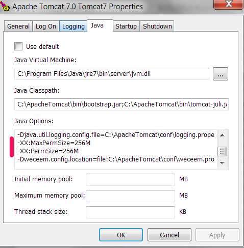

##Procedure for a tomcat7 deploy on Windows
###Procedimiento para hacer un tomcat7/Rails4 deploy en windows

1. Download [JDK7](http://www.oracle.com/technetwork/java/javase/downloads/index.html) + [tomcat7](http://tomcat.apache.org/download-70.cgi) + [JRuby 1.7.5 or later](http://www.jruby.org/download) + [Mariadb5.5](https://downloads.mariadb.org/) (or MySQL db) 
  - Bajar el Java Development Kit 7 (mas reciente), tomcat 7, JRuby 1.7.5 o mas reciente (1.7.10 es el mas reciente) y Mariadb 5.5 (o MySQL).
2. Set `JRUBY_OPTS --2.0` in the Environmental Variables. 
  - En 'Control Panel > System > Advanced system settings >> Environmental Variables...' cree una nueva variable `JRUBY_OPTS` y en su valor ponga `--2.0`.  Este paso posiblemente no sea necesario con JRuby 9K en adelante.  
3. Download and install Java Cryptographic Extensions (JCE) security files for Java7 and  on your `jre7/lib/security` folder overwrite the `local_policy.jar` and `US_export_policy.jar`. In windows the JRE is located usually in `Program Files`.
  - Bajar e instalar los JCE (Java Cryptographic Exentsions) para windows del website de Oracle. 
4. __NO SPACES__ on path for tomcat!!! (no # either) (windows limitation)
  - El path para la instalacion de tomcat no puede tener espacios ni caracteres especiales.
5. At the WEB-INF dir do `jruby -S rake db:migrate RAILS_ENV=production`
  - Corra el commando `jruby -S rake db:migrate RAILS_ENV=production` para crear la base de datos. El commando debe correr del archivo localizado en `<tomcat location>/webapps/<app name>/WEB-INF/`
6. Set Tomcat server Heap memory up on the Java tab in windows (Rails 4 requirement) or in `/etc/default/tomcat7` in Ubuntu Linux.
   - `-XX:MaxPermSize=256M`
   - `-XX:PermSize=256M`
     - Cambiar el setting de 'Heap Memory' en el tab de Java en la aplicación para el monitoreo de Tomcat (Windows) o en la configuración de Java.
   
   
   
##En la maquina de deploy  

1. Utilize Warble 1.4.0.beta1 o mas reciente
2. Cree un web.xml para que se copie -- no lo deje autogenerar.
3. Run JRuby Lint to find issues
4. Flip heroku settins en:
  - Gemfile
  - file
  - file
  
Notas:

Ubuntu: `sudo service tomcat7 {stop|start|restart}`